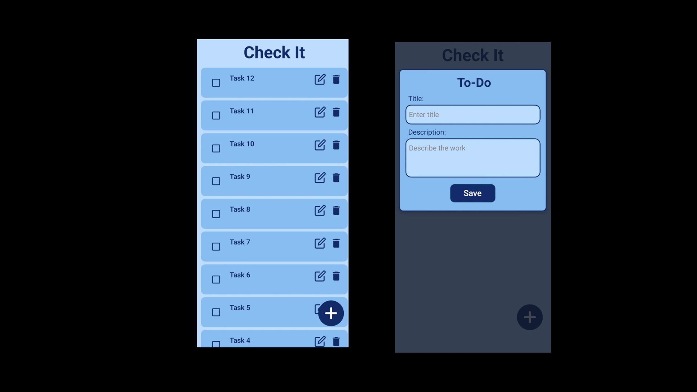

# 📋 React Native Todo App

A simple **Todo App** built in **React Native** using **Context API** for state management and **AsyncStorage** for persistent local storage.

---

## 🚀 Features
- Add new tasks 📝
- Edit existing tasks ✏️
- Delete tasks ❌
- Mark tasks as complete ✅
- Persistent storage using AsyncStorage
- Clean, minimal UI with modal popups
- Works on both Android and iOS

---

## 🎨 Color Palette
- Muted Blue: `#6A89A7`
- Light Blue: `#BDDDFC`
- Medium Bright Blue: `#88BDF2`
- Dark Blue: `#122B68`

---

## ⚙️ Tech Stack
- React Native
- React Context API
- AsyncStorage (for local persistence)
- Expo (for easier development & deployment)

---

## 📱 Screenshots


---

## 💻 Getting Started

### 1️⃣ Clone this repository
```bash
git clone https://github.com/magnum1122/react-native-todo-app.git
cd react-native-todo-app

### 2️⃣ Install dependencies
```bash
npm install
# or
yarn install

### 3️⃣ Run the app
```bash
npx expo start

🔧 Folder Structure

/app/Context/todoContext.js        - Todo Context API Provider
/assets/images                     - Images and Icons
/app                               - App Screens (index.js, _layout.tsx etc.)


⭐️ Contributions

Feel free to submit issues or pull requests.
Let me know if you have any ideas to improve it!


📄 License

This project is open source under the MIT License.


Made with ❤️ by Abhishek Chauhan